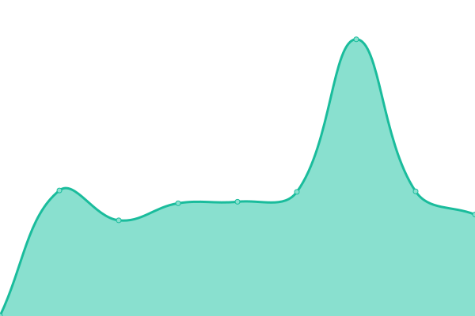
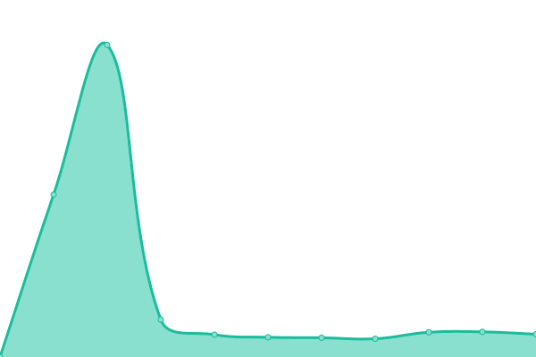
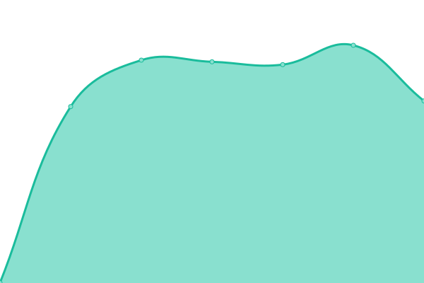
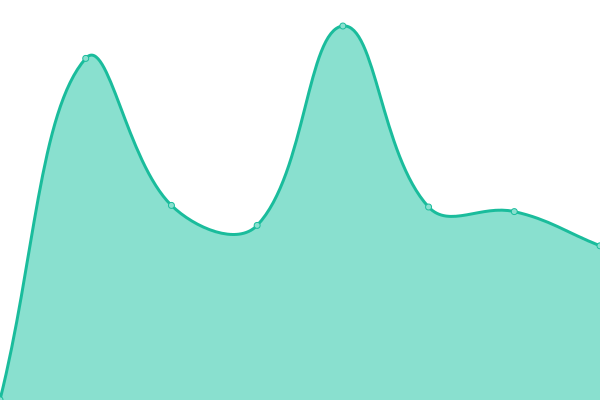

# [📈 Live Status](https://upptime.pods.my.id): <!--live status--> **🟧 Partial outage**

This repository contains the open-source uptime monitor and status page for [Upptime](https://upptime.js.org), powered by [Upptime](https://github.com/upptime/upptime).

With [Upptime](https://upptime.js.org), you can get your own unlimited and free uptime monitor and status page, powered entirely by a GitHub repository. We use [Issues](https://github.com/upptime/upptime/issues) as incident reports, [Actions](https://github.com/sipamungkas/upptime-stats/actions) as uptime monitors, and [Pages](https://upptime.pods.my.id) for the status page.

<!--start: status pages-->
<!-- This summary is generated by Upptime (https://github.com/upptime/upptime) -->
<!-- Do not edit this manually, your changes will be overwritten -->
<!-- prettier-ignore -->
| URL | Status | History | Response Time | Uptime |
| --- | ------ | ------- | ------------- | ------ |
|  [Daily Language Dev API](https://dl-api-dev.app-dev.my.id/api/v1/ping) | 🟥 Down | [daily-language-dev-api.yml](https://github.com/sipamungkas/upptime-stats/commits/HEAD/history/daily-language-dev-api.yml) | 

 866ms
     
 | 

<a href="https://upptime.pods.my.id/history/daily-language-dev-api">99.13%</a>
    

|  [Daily Langauge Dev Dashboard](http://dl-dev.app-dev.my.id/) | 🟥 Down | [daily-langauge-dev-dashboard.yml](https://github.com/sipamungkas/upptime-stats/commits/HEAD/history/daily-langauge-dev-dashboard.yml) | 

 2397ms
     
 | 

<a href="https://upptime.pods.my.id/history/daily-langauge-dev-dashboard">98.06%</a>
    

|  [Daily Langauge Prod API](https://api.dailylanguage.my.id/api/v1/ping) | 🟩 Up | [daily-langauge-prod-api.yml](https://github.com/sipamungkas/upptime-stats/commits/HEAD/history/daily-langauge-prod-api.yml) | 

 795ms
     
 | 

<a href="https://upptime.pods.my.id/history/daily-langauge-prod-api">100.00%</a>
    

|  [Daily Language Prod Dashboard](https://dailylanguage.my.id) | 🟩 Up | [daily-language-prod-dashboard.yml](https://github.com/sipamungkas/upptime-stats/commits/HEAD/history/daily-language-prod-dashboard.yml) | 

 788ms
     
 | 

<a href="https://upptime.pods.my.id/history/daily-language-prod-dashboard">100.00%</a>
    

|  [DL Prod Server](103.127.132.76) | 🟩 Up | [dl-prod-server.yml](https://github.com/sipamungkas/upptime-stats/commits/HEAD/history/dl-prod-server.yml) | 

 322ms
     
 | 

<a href="https://upptime.pods.my.id/history/dl-prod-server">100.00%</a>
    

<!--end: status pages-->

[**Visit our status website →**](https://upptime.pods.my.id)

## 📄 License

- Powered by: [Upptime](https://github.com/upptime/upptime)
- Code: [MIT](./LICENSE) © [Anand Chowdhary](https://anandchowdhary.com), supported by [Pabio](https://pabio.com)
- Data in the `./history` directory: [Open Database License](https://opendatacommons.org/licenses/odbl/1-0/)
